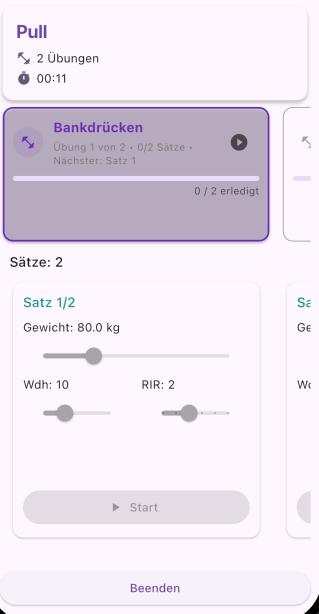
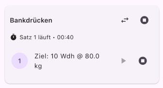
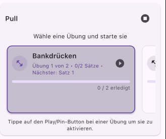
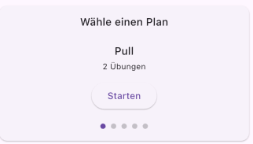
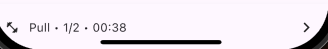
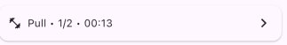

# fitness_workout / workout_runner_flutter

Ein flexibles Flutter-Package, um **Workouts zu starten, Sätze zu tracken und Ergebnisse auszuwerten**.  
Es liefert eine klare Trennung aus **Controller-Logik** (State, Timer, Persistenz) und **UI-Widgets** (Panels, Cards, Bottom-Banner).

---

## Features

- 📋 **Workout-Pläne** mit Übungen & Ziel-Sätzen (Reps, Gewicht)
- ▶️ **Starten/Fortsetzen** eines Workouts (inkl. Auto-Resume nach App-Neustart)
- ⏱️ **Timer**: Workout-, Set- und Pausen-Timer
- ✅ **Satz-Tracking**: Gewicht, Wiederholungen, RIR, Satzdauer
- 🧠 **Persistenz** via `SharedPreferences` (Storage-Interface austauschbar)
- 🧩 **Fertige Widgets**: `RunnerPanel`, `QuickRunner`, `CurrentExercise`, `CurrentSet/SetView`, `Results`, `RunnerDefaultScreen`
- 🎨 **Theming/Styling** per Parametern (Farben, TextStyles) überschreibbar

---

## Getting started

1. In der `pubspec.yaml` eintragen:
```yaml
dependencies:
  fitness_workout: ^0.0.1
```

2. Optional schon beim App-Start konfigurieren (inkl. Auto-Resume):
```dart
void main() async {
  WidgetsFlutterBinding.ensureInitialized();
  await runner.configure(autoResume: true); // lädt aktives Workout, falls vorhanden
  runApp(const App());
}
```

---

## Usage (Schnellstart)

```dart
import 'package:fitness_workout/fitness_workout.dart';
import 'package:fitness_workout/example/lib/runner_screen.dart';

Future<void> main() async {
  WidgetsFlutterBinding.ensureInitialized();
  await runner.configure();
  runApp(const App());
}

class App extends StatelessWidget {
  const App({super.key});
  @override
  Widget build(BuildContext context) {
    return const MaterialApp(home: Home());

    class Home extends StatelessWidget {
  const Home({super.key});
    List<WorkoutPlan> _plans() => [
    WorkoutPlan(
      id: 'p1',
      name: 'Pull',
      exercises: [
        WorkoutExercise(
          id: 'bp',
          name: 'Bankdrücken',
          sets: [
            WorkoutSet(targetReps: 10, targetWeight: 80),
            WorkoutSet(targetReps: 8, targetWeight: 85),
          ],
        ),
        WorkoutExercise(
          id: 'ohp',
          name: 'OHP',
          sets: [WorkoutSet(targetReps: 10, targetWeight: 50)],
        ),
      ],
    ),
    WorkoutPlan(
      id: 'p2',
      name: 'Push',
      exercises: [
        WorkoutExercise(
          id: 'sqt',
          name: 'Squat',
          sets: [
            WorkoutSet(targetReps: 10, targetWeight: 100),
            WorkoutSet(targetReps: 8, targetWeight: 110),
          ],
        ),
      ],
    ),
  ];
    final plans = _plans();
          appBar: AppBar(
        title: const Text('Workouts'),
        actions: [
          Padding(
            padding: const EdgeInsets.symmetric(horizontal: 8),
            child: RunnerStatusChip(controller: runner),
        ],
              body: Column(
        children: [
          QuickRunner(controller: runner, plans: _plans()),
          RunnerStatusBanner(controller: runner),
          Expanded(
            child: ListView.builder(
              itemCount: plans.length,
              itemBuilder: (context, i) {
                final plan = plans[i];
                return ListTile(
                  title: Text(plan.name),
                  subtitle: Text('${plan.exercises.length} Übungen'),
                  onTap: () {
                    Navigator.push(
                      context,
                      MaterialPageRoute(
                        builder: (_) => RunnerScreen(plan: plan),
                      ),
                    );
                  },
                );
              },
            ),
          ),
        ],
      ),
      bottomNavigationBar: RunnerStatusBottomBar(controller: runner),
      ```
      ---

## Die wichtigsten Widgets

- **`RunnerScreen`** – Kompletter Screen mit AppBar, Panel, Finish-Flow
- **`RunnerPanel`** – Panel mit Workout-Header, Übungsauswahl, Sets, Finish-Button
- **`CurrentWorkout`** – Zeigt Plan/Timer/Gesamtstatus
- **`CurrentExercise`** – Pager zur Auswahl/Start der Übung (inkl. „pinned“ State)
- **`CurrentSet` / `SetView`** – Kompakte/ausführliche Ansicht zum aktuellen Satz
- **`Results`** – Abschlussansicht mit Finish-Callback
- **Status-Widgets**: `RunnerStatusAppBar`, `RunnerStatusChip`, `RunnerStatusBanner`, `RunnerStatusBottomBar`

---

## Controller & Persistenz

- **Controller**: `WorkoutRunnerController` (Singleton `runner`) hält State & Timer
- **Persistenz**: Standard `PrefsRunnerStorage` (SharedPreferences)
- **Auto-Resume**: `await runner.configure(autoResume: true)` beim App-Start aufrufen

### Manuell starten

```dart
await runner.start(plan, resumeIfPossible: false);
```

### Satz-APIs (UI-unabhängig)

```dart
runner.setActiveExercise(index);
runner.startSet(exerciseIndex, setIndex);
await runner.finishActiveSet(weight: 80, reps: 8, rir: 2);
runner.skipRest();
final done = runner.getPerformedSet(exerciseIndex, setIndex);
```

### Workout beenden

```dart
final result = await runner.finish();


```

---
## Screenshots

### RunnerScreen


### QuickRunner





### Bottom


### Bar

---

---

## Contribution

- Issues & Feature-Wünsche: bitte via GitHub-Issues
- PRs sind willkommen. Bitte kleine, thematisch saubere Branches.

---

## Lizenz

MIT License – siehe `LICENSE`.
