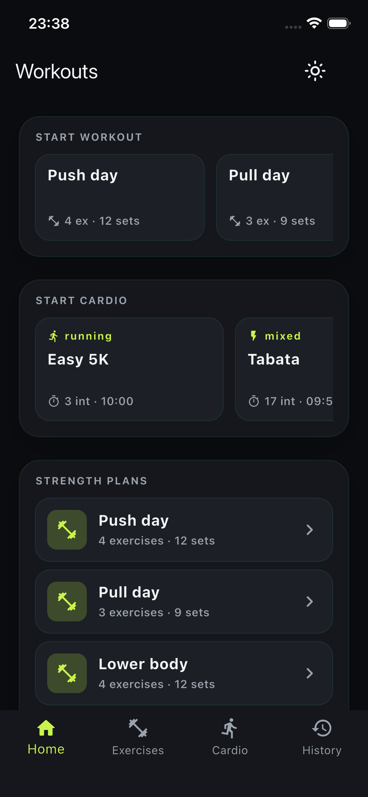
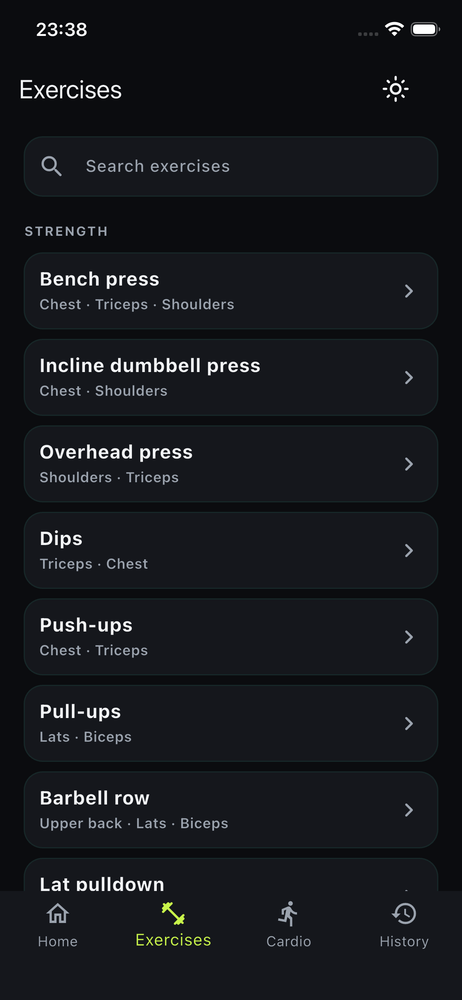
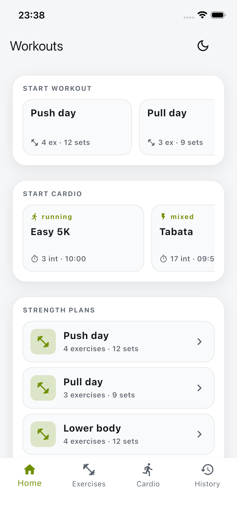
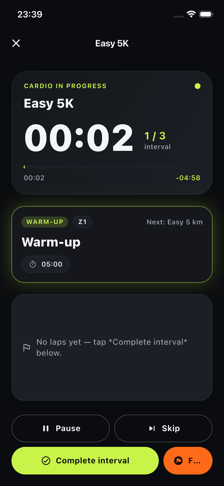
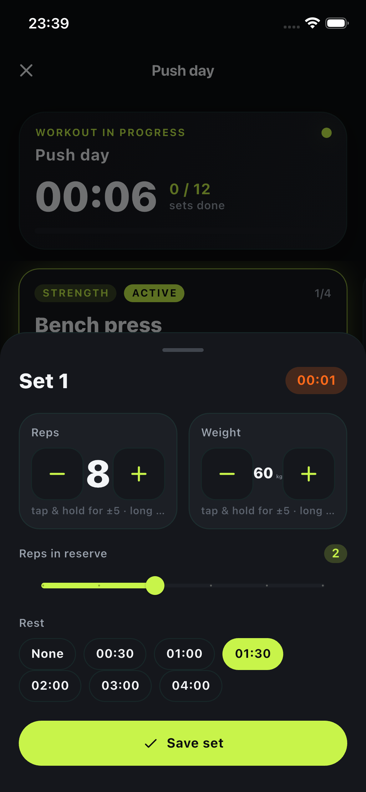
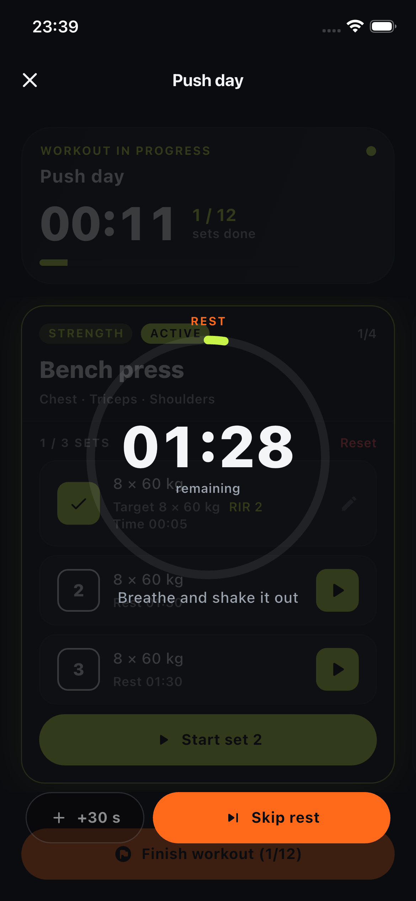

# fitness_workout

A Flutter package for running, tracking and finishing workouts.

It ships:

- **`WorkoutRunner`** — a `ChangeNotifier`-based controller with timers,
  set/exercise indices, plan mutation, persistence and a `Stream<WorkoutResult>`
  finished hook.
- **`CardioRunner`** — interval / lap based companion controller for
  running, cycling, rowing, HIIT, jump rope, etc. Same lifecycle shape,
  same storage interface, a separate slot so it coexists with the
  strength runner.
- **Pluggable `RunnerStorage`** with `SharedPreferences` and in-memory
  implementations. Roll your own to point at SQLite, Hive, Supabase, …
- **Drop-in widgets** in a dark-first fitness style for both sides:
  `RunnerPanel`, `QuickRunner`, `ResultsView`, `RunnerStatusChip` /
  `Banner` / `BottomBar`, full `RunnerScreen`, and their cardio peers
  (`CardioRunnerPanel`, `CardioQuickRunner`, `CardioResultsView`,
  `CardioRunnerStatusChip` / `Banner` / `BottomBar`, `CardioRunnerScreen`).
- **`WorkoutRunnerTheme`** with design tokens you can override to re-style
  every bundled widget.

> Requires Flutter ≥ 3.16 / Dart ≥ 3.7.

---

## Install

```yaml
dependencies:
  fitness_workout: ^1.0.0
```

```dart
import 'package:fitness_workout/fitness_workout.dart';
```

---

## Screenshots

<table>
  <tr>
    <td align="center"><br><sub>Quick runner</sub></td>
    <td align="center"><br><sub>Runner panel</sub></td>
    <td align="center"><br><sub>Set input</sub></td>
  </tr>
  <tr>
    <td align="center"><br><sub>Rest overlay</sub></td>
    <td align="center"><br><sub>Results</sub></td>
    <td align="center"><br><sub>Cardio runner</sub></td>
  </tr>
</table>

---

## Quick start

```dart
final runner = WorkoutRunner();

void main() async {
  WidgetsFlutterBinding.ensureInitialized();
  await runner.tryAutoResume(); // optional — resumes a previous workout

  runApp(MaterialApp(home: Home(runner: runner)));
}

class Home extends StatelessWidget {
  final WorkoutRunner runner;
  const Home({super.key, required this.runner});

  @override
  Widget build(BuildContext context) {
    final plan = WorkoutPlan(
      id: 'fullbody',
      name: 'Full body',
      exercises: DefaultExercises.all.take(5).toList(),
    );

    return RunnerScope(
      runner: runner,
      child: Scaffold(
        appBar: AppBar(
          title: const Text('Workouts'),
          actions: const [RunnerStatusAppBarAction()],
        ),
        body: QuickRunner(
          plans: [plan],
          onOpen: (p) => Navigator.of(context).push(
            MaterialPageRoute(
              builder: (_) => RunnerScreen(plan: p, runner: runner),
            ),
          ),
        ),
        bottomNavigationBar: const RunnerStatusBottomBar(),
      ),
    );
  }
}
```

You can build plans fluently instead of nesting model constructors:

```dart
final plan = WorkoutPlanBuilder('Push Day')
    .exercise('Bench Press')
    .set(reps: 8, weight: 80, rest: const Duration(seconds: 90))
    .set(reps: 8, weight: 80)
    .exercise('Shoulder Press')
    .set(reps: 10)
    .build();

final validation = plan.validate();
if (!validation.isValid) {
  for (final issue in validation.errors) {
    debugPrint(issue.message);
  }
}
```

Listen for finished workouts anywhere:

```dart
runner.finished.listen((result) {
  // ship to backend, log to analytics, …
  print('Done in ${result.duration}, '
        '${result.totalSets} sets, '
        '${result.totalVolume} kg total volume.');
});
```

Or attach lightweight lifecycle callbacks:

```dart
runner
  ..onSetCompleted = (set) => debugPrint('Set ${set.setIndex + 1} done')
  ..onExerciseChanged = (index) => debugPrint('Showing exercise $index')
  ..onRestStarted = (rest) => debugPrint('Rest: ${rest.inSeconds}s');
```

---

## Cardio runner

`CardioRunner` is the interval-based companion to `WorkoutRunner` — for
plans built out of laps (`CardioInterval`) rather than `(set × reps ×
weight)` tuples.

```dart
final cardio = CardioRunner();

void main() async {
  WidgetsFlutterBinding.ensureInitialized();
  await cardio.tryAutoResume();

  runApp(MaterialApp(home: CardioHome(runner: cardio)));
}

class CardioHome extends StatelessWidget {
  final CardioRunner runner;
  const CardioHome({super.key, required this.runner});

  @override
  Widget build(BuildContext context) {
    return CardioRunnerScope(
      runner: runner,
      child: Scaffold(
        appBar: AppBar(
          title: const Text('Cardio'),
          actions: const [CardioRunnerStatusChip(), SizedBox(width: 8)],
        ),
        body: Center(
          child: ElevatedButton(
            onPressed: () => Navigator.of(context).push(
              MaterialPageRoute(
                builder: (_) => CardioRunnerScreen(
                  plan: DefaultCardioPlans.tabata,
                  runner: runner,
                ),
              ),
            ),
            child: const Text('Start Tabata'),
          ),
        ),
      ),
    );
  }
}
```

`CardioRunner` defaults to slot `'cardio'`, while `WorkoutRunner` defaults
to slot `'default'`. The two can share the same `RunnerStorage` without
collision, so you can nest both scopes near the root of your app and run
strength + cardio sessions side-by-side:

```dart
RunnerScope(
  runner: strengthRunner,
  child: CardioRunnerScope(
    runner: cardioRunner,
    child: const MaterialApp(home: Home()),
  ),
)
```

Cardio exposes the same kind of lightweight lifecycle hooks:

```dart
cardio
  ..onIntervalCompleted = (lap) => debugPrint('Lap ${lap.intervalIndex + 1}')
  ..onPaused = () => debugPrint('Cardio paused')
  ..onResumed = () => debugPrint('Cardio resumed');
```

See [`doc/ARCHITECTURE.md`](doc/ARCHITECTURE.md#two-runners-strength--cardio)
for the coexistence model.

---

## What's in the box

| Widget | Purpose |
|---|---|
| `RunnerPanel` | Plan header, exercise carousel, rest strip, finish button. |
| `RunnerScreen` | Stand-alone screen wrapping `RunnerPanel` + AppBar + result transition. |
| `QuickRunner` | "Start workout" picker that swaps to "Continue" when one is running. |
| `ResultsView` | Hero summary with stats and per-exercise breakdown. |
| `RunnerStatusChip` | Tiny "23:45" pill — safe to drop into any AppBar. |
| `RunnerStatusBanner` | Inline banner under your AppBar / hero block. |
| `RunnerStatusBottomBar` | Bottom-attached "continue workout" CTA. |
| `SetRow` | Individual set row with start / running / done states + input sheet. |
| `CardioRunnerPanel` | Hero timer + interval card + lap timeline + control bar. |
| `CardioRunnerScreen` | Stand-alone cardio screen + result transition. |
| `CardioQuickRunner` | "Start cardio" picker that swaps to "Cardio running" when active. |
| `CardioResultsView` | Hero summary with laps, work time, distance, average pace. |
| `CardioRunnerStatusChip` | Tiny accent pill with elapsed cardio time. |
| `CardioRunnerStatusBanner` | Inline banner highlighting the running cardio session. |
| `CardioRunnerStatusBottomBar` | Bottom-attached "continue cardio" CTA. |

Strength widgets read from the nearest `RunnerScope`; cardio
widgets read from the nearest `CardioRunnerScope`.

---

## Theming

```dart
WorkoutRunnerTheme(
  data: WorkoutRunnerThemeData.dark().copyWith(
    accent: const Color(0xFFFF7E2A), // switch to orange
  ),
  child: const RunnerScreen(...),
);
```

See `doc/THEMING.md` for the full token list.

---

## Custom storage

```dart
class SupabaseRunnerStorage implements RunnerStorage {
  // implement read/save/clear for state + plan
}

final runner = WorkoutRunner(storage: SupabaseRunnerStorage());
```

See `doc/STORAGE.md`.

---

## Screenshots

The example app under `example/` demonstrates every widget. Run it with
`cd example && flutter run`.

---

## Documentation

| File | Content |
|---|---|
| [`doc/ARCHITECTURE.md`](doc/ARCHITECTURE.md) | Module map, data flow, lifecycle |
| [`doc/API.md`](doc/API.md) | Public API reference |
| [`doc/WIDGETS.md`](doc/WIDGETS.md) | Widget gallery with code snippets |
| [`doc/STORAGE.md`](doc/STORAGE.md) | Implementing your own storage |
| [`doc/THEMING.md`](doc/THEMING.md) | Design tokens and overrides |
| [`doc/MIGRATION.md`](doc/MIGRATION.md) | Upgrading from 0.x to 1.0 |

---

## License

MIT — see [`LICENSE`](LICENSE).
